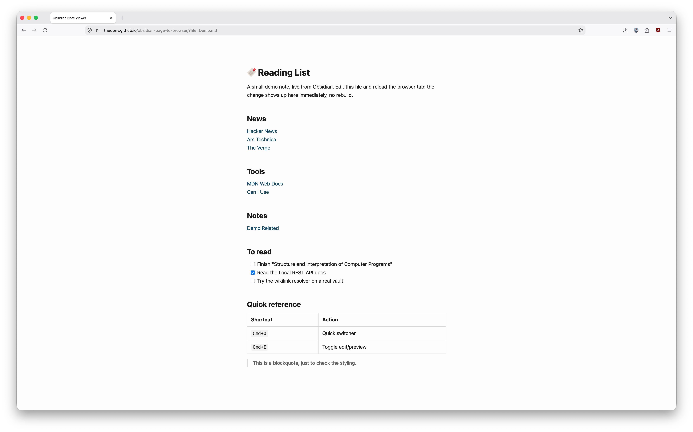

# Obsidian Page to Browser

[](LICENSE)
[](https://github.com/theopnv/obsidian-page-to-browser/stargazers)
[](CONTRIBUTING.md)


Turn any note in your Obsidian vault into a live webpage. Bookmark it in your browser toolbar, click it, and get a clean, styled page instead of raw markdown. Edit the note in Obsidian, reload the tab, and the change is already there. No build step, no static site generator, no regenerate command. Everything stays on your computer.

It talks to the [Local REST API (with MCP)](https://github.com/coddingtonbear/obsidian-local-rest-api) plugin, which runs inside Obsidian and serves your vault over HTTPS on your own machine.

## Why this alternative?

| | Notion | Static site generator | This |
| --- | --- | --- | --- |
| Updates live, no rebuild | ✅ | ❌ | ✅ |
| Plain markdown files, no lock-in | ❌ Proprietary format | ✅ | ✅ |
| Notes stay off someone else's server | ❌ Stored on Notion's servers, not encrypted end-to-end | ❌ Published output is public once built | ✅ Fetched live from your machine, only the empty viewer is public |

Turn anything into a webpage without needing to switch context back to Obsidian:

- **A bookmarks or reading list page.** My original use case: a curated list of links, styled, always current.
- **A map-of-content note.** An index note that fans out through `[[wikilinks]]`, browsable like a small personal wiki.
- **A running dashboard.** A project status or task note you check often, one bookmark away instead of buried in a vault.
- **A cheatsheet.** Commands, shortcuts, snippets you copy from mid-terminal, rendered as a real page instead of a wall of markdown syntax.

## Screenshot



## What it does

- Everything stays on your computer.
- Renders standard markdown: headings, lists, tables, task lists, code blocks, links.
- Renders `[[wikilinks]]` and `[[wikilinks|with an alias]]`. Clicking one loads that note in place, no page reload.
- Opinionated but basic theme. There might be inconsistencies here and there, for which PRs are welcome.

## What it doesn't do

- Complex rendering such as: Callouts, `![[embeds]]`, `#tags`, and frontmatter.
- Desktop only. The Local REST API only listens on `127.0.0.1`, so this won't work from your phone.
- One vault, one browser profile. No account switching.

## Two ways to use this

**Use the hosted copy.** Skip hosting entirely. This repo is published at `https://theopnv.github.io/obsidian-page-to-browser/`. Do the vault setup below, then bookmark your page against that address. It's a static site with no backend, so your API token stays in your own browser and talks only to your own vault, but you're trusting that the published code matches what's in this repo. It's open source, so you can check.

**Host your own copy.** Fork the repo, publish it to your own GitHub Pages, and bookmark against your own URL instead. Same code, nothing to trust but your own copy of it.

## Install

> [!NOTE]
> Steps 1 and 2 apply either way. Step 3 only applies if you're hosting your own copy.

### 1. Set up the plugin in Obsidian

- Open Obsidian → Settings → Community plugins.
- Turn off restricted mode if it's on.
- Browse, search for "Local REST API", install it, turn it on.
- Open its settings page. Note the HTTPS port (default `27124`) and copy the API key. You'll need both.

### 2. Trust its certificate

The plugin uses a self-signed HTTPS certificate. **Your browser will block it until you trust it once.**

- Open a new tab and go to `https://127.0.0.1:27124` (use your own port if different).
- Your browser shows a warning ("Your connection is not private" in Chrome and Safari, a similar warning in Firefox). Click through it ("Advanced" → "Proceed" in Chrome, "Advanced" → "Accept the Risk and Continue" in Firefox, "visit this website" in Safari).
- You should see a short JSON reply. That means it worked.

This is a one-time step per browser. Chrome, Firefox, and Safari each track this separately, so repeat it in each browser you use.

### 3. Host your own copy (skip to 4 if using the hosted copy)

Fork it: go to `https://github.com/theopnv/obsidian-page-to-browser` and click "Fork". Or with the `gh` CLI:

```bash
gh repo fork theopnv/obsidian-page-to-browser --clone
```

Then turn on Pages on your fork: repo → Settings → Pages → Source: "Deploy from a branch" → branch `main`, folder `/ (root)` → Save. GitHub gives you a URL like `https://<your-username>.github.io/obsidian-page-to-browser/`. It takes about a minute to go live.

These are plain static files (`index.html`, `src/`, `theme/`), so any static host works the same way if you'd rather not use GitHub Pages: Netlify, Vercel, Cloudflare Pages, or your own server. To test locally, clone the repo and run `npx serve .` or `python3 -m http.server`, then open `http://localhost:<port>/`.

### 4. First-time setup in the browser

Open the viewer URL, either the hosted one or your own. Since there's no saved config yet, it shows a form asking for:

- **API base URL**: `https://127.0.0.1:27124` (or your own port)
- **API token**: the key you copied from the plugin settings

Your browser saves this in `localStorage`, tied to that one site. Bookmarked URLs never carry the token, only a file path.

If you use more than one browser, or host the viewer at more than one URL, repeat this step in each.

## Usage

Open a note by adding `?file=` and its path in the vault to the URL:

```
https://<your-viewer-url>/?file=Resources%2FBookmarks%2FBookmarks.md
```

The path is relative to your vault root, URL-encoded (spaces become `%20`, slashes become `%2F`).

Bookmark that full URL in your browser toolbar. Clicking it opens the rendered note directly.

Inside a rendered note:
- Normal links (`http://`, `https://`) behave like any web link.
- `[[Wikilinks]]` resolve against your vault and load in place, no reload.

To bookmark a different note, open it once with its own `?file=` URL and bookmark that.
